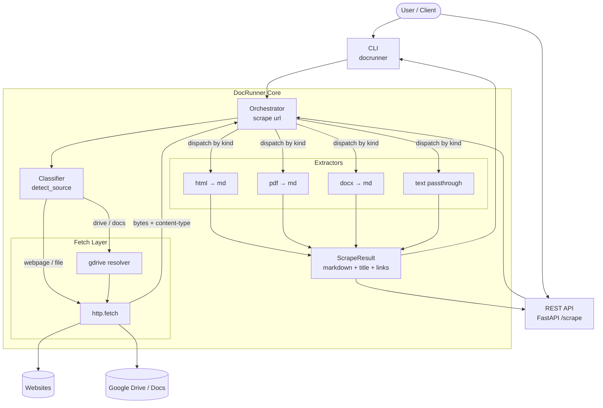
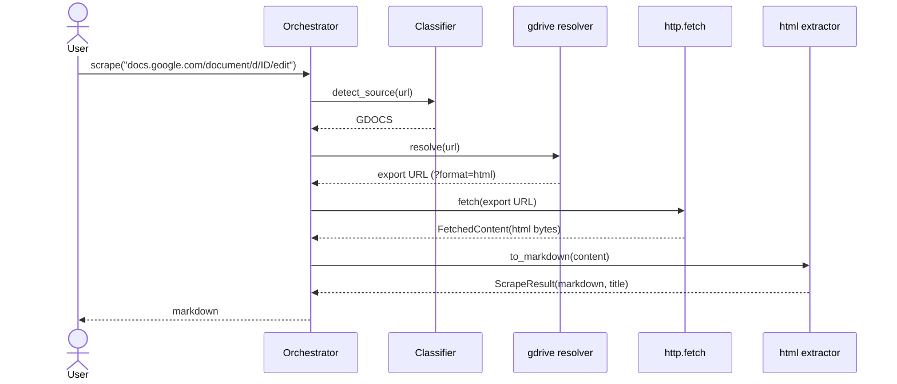
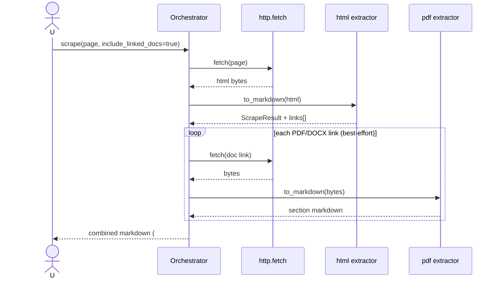
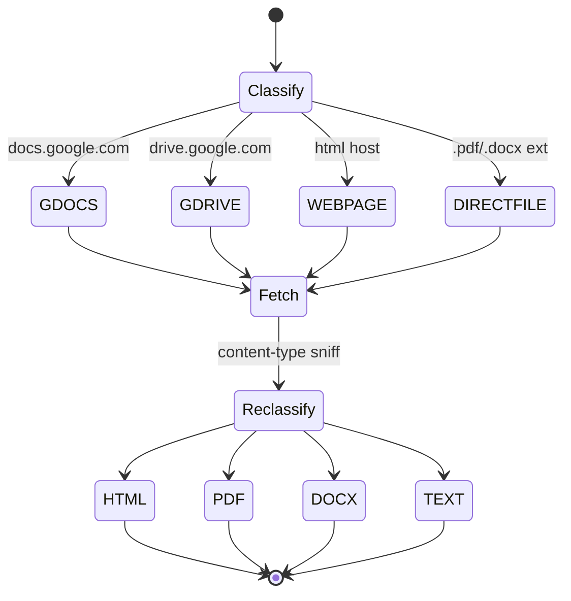

# DocRunner — System Diagrams

## C4 — Component / pipeline

## Sequence — scrape a Google Docs link

## Sequence — webpage with linked PDF (include_linked_docs)

## State — source classification & re-classification

